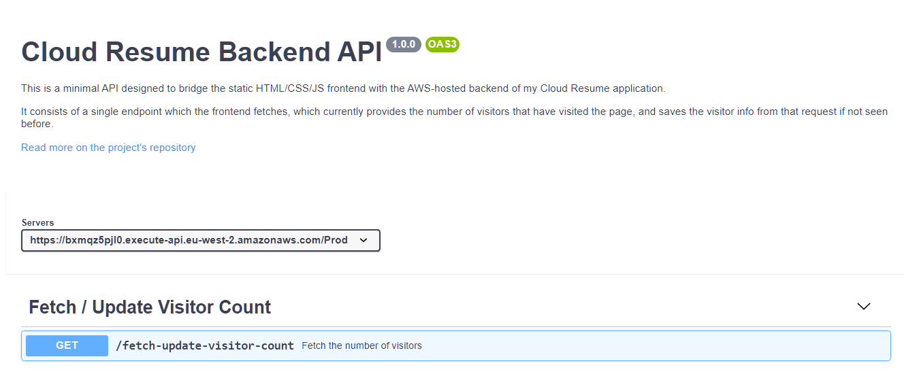

# Cloud Resume Backend 

The backend for my [cloud resume application](https://resume.laripping.com).

Application components:
- An API Gateway Rest API : that the frontend JS will interact with 
- A DynamoDB Table : holding visitors' User Agents and IP addresses
- A Python Lambda Function : serving as the controller that bridges the two

Building the stack - both major IaC tools supported:
- The AWS **SAM** CLI: See section [SAM Deployment](#sam-deployment). The SAM template is defined in `template.yml`
- **Terraform**: See repo for the `.tf` code

Also included in this repo
- [x] [Tests](TESTING.md): Integration & Unit tests
- [x] [CI/CD pipeline](.github/workflows/sam-pipeline.yml) using SAM, through Github Actions


## API: The Spec

Documentation for the API exposed that bridges the frontend and backend code ([link](https://petstore.swagger.io/?url=https://raw.githubusercontent.com/LAripping/cloud-resume-backend/master/apispec.yml)) 





## Lambda: Python Development 

To develop/test the Lambda function locally, using PyCharm in a WSL2 environment, you first need to setup the Python environment.  

### Env Setup
We'll use a pyenv / pip / virtualenv combo:
```bash
$ cd hellow_world
$ pyenv virtualenv 3.8.0 .venv
$ pyenv activate .venv
$ python3 -m pip install -r requirements.txt
$ # do work, add imports... then update
$ python3 -m pip freeze > requirements.txt
```

Note that PyCharm won't work well with an interpreter inside WSL, so instead create another virtualenv interpreter for the project in Windows land, based off of Python(.exe) 3.8  with the `fetch_visitors/requirements.txt`. Name the virtualenv `venv` as to be ignored by git. Then finally `pip install -r requirements.txt` using that Windows-land `venv/python.exe` 


### Local Build/Run

The Lambda function can be tested locally [in a container](https://docs.aws.amazon.com/lambda/latest/dg/images-create.html) using Docker Desktop. The container image used (see `Dockerfile`) is based off of a public Python3.8 ECR image built specifically for simulating Lambdas.  
Secrets/IDs needed by this pseudo-lambda container are passed as evironment variables, in a dedicated file using the `--env-file` runtime option. A skeleton [env](.env) file speficying all the keys needed is provided.  

1. Build the Lambda image:
```bash
docker build -t fetch-update-visitors:latest .
```

2. Assume Lambda's IAM role and specify the temp token into the env file 
```bash
assume-role.sh tf-lambda-role env
```

3. Start the container, specifying the env vars:
```bash
docker run -p 9000:8080 --env-file env fetch-update-visitors:latest
```
This starts up an endpoint locally at [http://DOCKERIP:9000/2015-03-31/functions/function/invocations](http://localhost:9000/2015-03-31/functions/function/invocations)
The boto client in the Python code will read the env vars to assume the role needed by the Lambda

4. Invoke the endpoint passing an example file:
```bash
curl -vv -XPOST "http://127.0.0.1:9000/2015-03-31/functions/function/invocations" -d "$(tr -d "\n" < events/event-from-browser.json)" -H 'Content-Type:application/json'
```


### Run Tests
> 🔑 Note that at least one integration test uses `boto3` client which needs to be configured with an IAM user allowed to 
> - `cloudformation:DescribeStacks:*`
> - `dynamodb:Scan:VisitorsSam`
> - `dynamodb:DynamoDeleteItem:VisitorsSam`
> Creds for this can be passed as environment variables `AWS_ACCESS_KEY_ID` and `AWS_SECRET_ACCESS_KEY`

Tests are defined in the `tests` folder in this project and their `requirements.txt` are covered by the top-level ones. See [Tests](#tests) section for a listing.
To run test suites:
- from PyCharm: right-click the `tests` subdirectory and click "Run 'Python tests in test'..."
- in terminal: 

```bash
# Unit tests
$ python -m pytest tests/unit -v

# Integration tests (needs a deployment & $STACK_NAME to be set)
$ python -m pytest tests/integration -v
```


### Lambda Logs in PyCharm
> 💡 Notes for me

- Download PyCharm and install the AWS IntelliJ Toolkit
- Git clone and Open the project into PyCharm
- Configure the AWS Toolkit with an IAM user (eg. `aws-toolkit`) and confirm you can access CloudWatch logs 
  1. From the sidebar, expand the AWS Toolkit window
  2. In the first dropdown, choose the `aws-toolkit` IAM profile you've just configured
  3. In the second dropdown pick `eu-west-2` region
  4. Refresh
  5. Under CloudWatch Logs, there should be an entry like `/aws/lambda/sam-app-... `


## SAM Deployment

Instructions to deploy the backend manually using the [SAM CLI](https://github.com/aws/aws-sam-cli)

### CLI prep

On first run, configure SAM cli as follows 
1. Create an IAM user for the SAM CLI (eg. `samcli`)
> 🔒 Follow Least Privilege Principle: the minimum set of permissions it needs to work most of the times is described [here](https://docs.aws.amazon.com/serverless-application-model/latest/developerguide/sam-permissions.html#sam-permissions-managed-policies) 
2. Configure your AWS CLI with its creds (*as the default profile*) using `aws configure` 
> ❌ Unfortunately SAM CLI doesn't consistently follow `AWS_PROFILE` env, so we need have samcli be the default globally  
3. Extract the (fixed and rigid) stack name from conf, to use in commands
```bash
$ STACK_NAME=$(grep stack_name samconfig.toml | cut -d \" -f 2)
```
4. Set an alias to un-screw `os.getcwd()` after Docker-juggling (see the relevant [Troubleshooting](#troubleshooting) issue)
```bash
$ alias recd="cd ../ && cd -"
```

### Dev workflow

When messing with the `template.yaml` adding/removing AWS resources, follow the SAM cli workflow below to re-deploy the entire stack:

```bash
$ sam build # --use-container takes way too long
$ # sam package <- use this to feed packaged.yaml to the next steps, if anything complains about the lack of S3 urls
$ sam deploy  
$ sam local invoke      # tests the function
$ sam local start-api   # tests the API + the function 
```

From now on, you can edit/test the Python code as described below, and see it live by hitting http://127.0.0.1:3000/fetch-update-visitor-count. 
- No need to rebuild/redeploy as changes will appear instantly (mounted docker env)
- Do rebuild if you change `template.yaml`


### Running Locally/Remotely

One-liners

- To test locally
```bash
$ recd && sam build && sam local invoke -e events/event-from-browser.json
# and see logs in your terminal
```

- To test remotely
```bash
$ recd && sam build && sam deploy
# then Hit in chrome
# ...and look at CloudWatch logs in PyCharm
```


### All in one

If you've set the `AWS_` env vars for the `boto-test-runner` IAM user and want the SAM CLI commands to use your default -> `samcli` IAM user, run it all as such:
```bash
recd && sam build && sam deploy --profile default && python3 -m pytest tests/
```


### Troubleshooting 
- If you get weird Python SAM cli errors after `sam local invoke` maybe wait for a min / kill docker, it could be the mounted FS... or just `cd ../ && cd -`
- `sam deploy` complaining with "S3 Bucket not specified..." might be a silent permissions problem, as implicit assumption of an unintended profile forces the S3 call to fail misinterpretting it as an empty response. Make sure the right profile is picked up with `--debug`  
