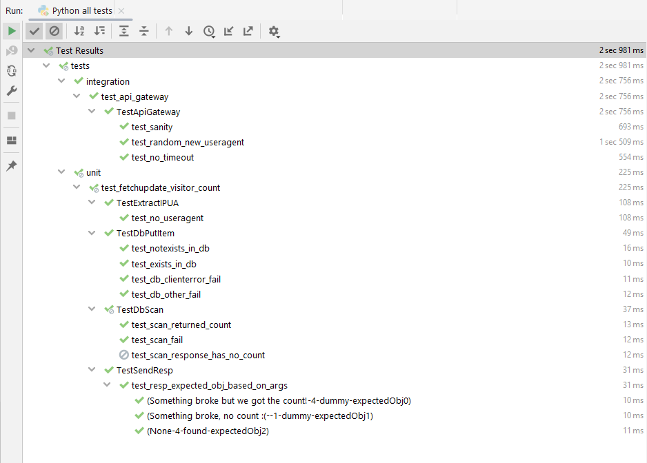

# Tests Written

## Integration tests

  > 🎯 Goal: To check that all components operate (integrate) with each other  
  > Testing multiple components at once  
  > "End 2 End"

  - [x] URL of API created responds to GET request as expected (200, json, valid result & count fields)
  - [x] Request takes less than 10 seconds to complete (= the timeout set server-side) to maintain performance when DB grows
  - [x] GET with time-based random UA results in addition (in JSON *and* by checking in the DB)

 

## Unit Tests

  > 🎯 Goal: To check a specific component  
  > Testing one single component at a time, to confirm that it operates in the right way. Helps you to isolate what is broken in your application and fix it faster  
  > "Per-Feature"

  - Step 1: Extract IP & UA
    - [x] no `User-Agent` header is provided
  - Step 2: DB Put Item : faking `boto3.client('dynamodb').put_item()`to ... ->  ensure our `db_putitem()` ...
    - [x] return but not throw -> returns "added"
    - [x] throw the "ConditionalCheckFailedException" -> returns "found"
    - [x] throw any other "ClientError" -> throws as well
    - [x] throw any other Exception -> throws as well
  - Step 3: DB Scan : faking `boto3.client('dynamodb).scan()` to ... -> ensure our `db_scan()` ...
    - [x] returns a legit count -> returns that number
    - [x] throws -> we throw too
    - [x] returns a resp with no "Count" key -> : this is intended to catch any upstream changes in boto3 that would break our app. Atm we won't handle it so we expect it to fail
  - Step 4: Sending the HTTP Response : check the returned response
    - [x] error has been previously thrown but count has been retrieved
    - [x] error has been previously thrown, no count has been retrieved
    - [x] no previous errors

## Design Decisions
Documenting the "why"s regarding the organisation and implementation of test code 

1. `pytest` instead of `unittest`, mainly due to [this](https://www.slant.co/versus/9148/9149/~unittest_vs_pytest)
   - so we'll use `@fixtures` instead of `self.setUp`
   - for fixtures involving events we'll extract into files to allow re-use 
   - we're allowed to have some stray `test_*` methods in `.py` files, instead of class-methods only
   - we'll simply name test case classes `Test*`, we won't subclass `unittest.TestCase`
2. We'll use end-2-end tests as Integration ones, conscious it's not the same (as per the [pyramid](https://blogs.sap.com/2022/02/16/how-to-write-independent-unit-test-with-pytest-and-mock-techniques/))
3. simple `assert expr` without messages, to make use of pytest's Advanced Assertion Introspection (AAI). Not unittest's redundant `self.assertSomething`  
4. Annotate with `#Arrange -> #Act -> #Assert`
5. [Integration] One `test*.py` file > One `class Test*` per feature > One `def test_*` method per case...
6. [Unit] One `test*.py` file per ~~src file~~ ~~src class~~ feature (so add a new one when the profiling comes in) > One `class Test*` per Step > One `def test_*`per case

The organisation looks like this: 
> Suite -> dir (integr/unit) -> script (component) -> class (step) -> method (case) [-> invocation (w. params)] 

